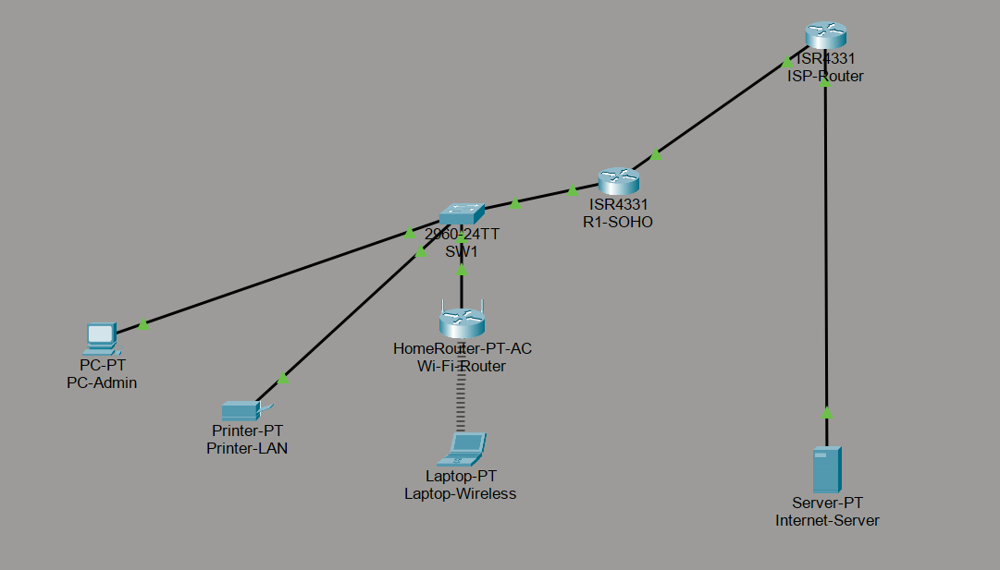
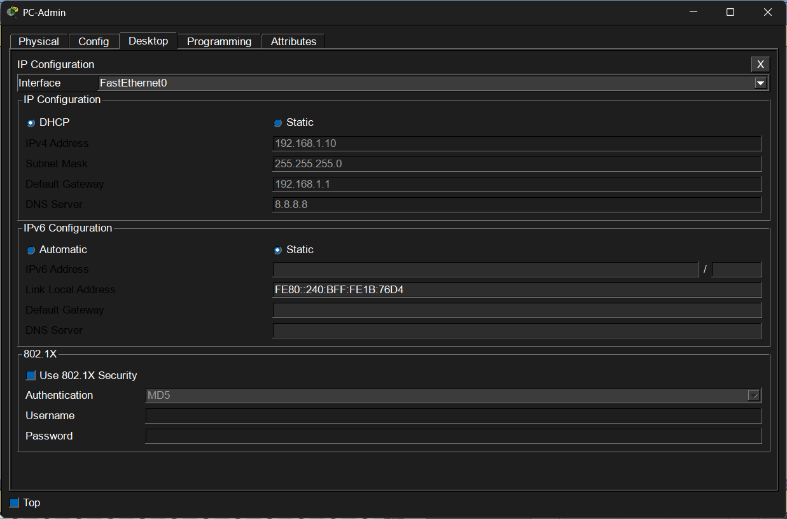
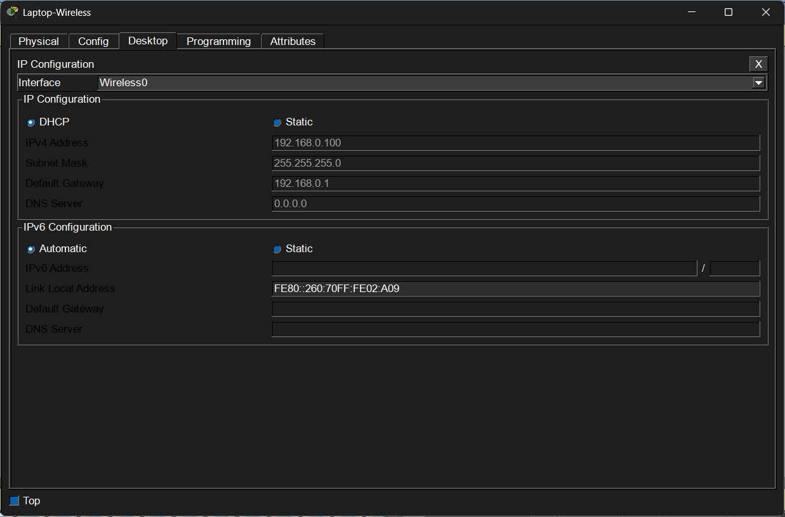

# 🟢 Level 1: SOHO Network (Small Office / Home Office)

## 🎯 จุดประสงค์ของโปรเจกต์

เพื่อจำลองสถาปัตยกรรมระบบเครือข่ายระดับเริ่มต้นสำหรับธุรกิจขนาดเล็ก Startup หรือ Co-working Space ที่มีพนักงานจำนวนไม่เกิน 20 คน

- มุ่งเน้นการจัดการระบบเครือข่ายให้พนักงานสามารถเข้าใช้งานอินเทอร์เน็ตได้อย่างปลอดภัยทั้งรูปแบบสาย LAN และคลื่นสัญญาณไร้สาย (Wi-Fi)
- ฝึกฝนการเปิดใช้งานบริการแจกจ่ายไอพีอัตโนมัติ (DHCP Server) เพื่อลดความซ้ำซ้อนและภาระงานของผู้ดูแลระบบในการตามแก้ไขไอพีทีละอุปกรณ์
- ประยุกต์ใช้งานเทคโนโลยี NAT (Network Address Translation) รูปแบบ Overload (PAT) เพื่อแปลง Private IP ภายในองค์กรให้ใช้งาน Public IP เดียวกันออกสู่อินเทอร์เน็ตได้อย่างคุ้มค่า

---

## 🖼️ Network Topology



---

## 🔬 เกณฑ์และวิธีการทดสอบระบบ (Verification Checklist)

### 1. การทดสอบระบบ DHCP

- เปิดพอร์ตคอมพิวเตอร์ **PC-Admin**
- เปลี่ยนโหมดเป็น **DHCP**
- อุปกรณ์ต้องได้รับ:
  - IP Address ในวง `192.168.1.0/24`
  - Default Gateway `192.168.1.1`
  - DNS Server `8.8.8.8`

#### 📷 ผลการทดสอบ DHCP



---

### 2. การทดสอบระบบเชื่อมต่อ Wi-Fi

- อุปกรณ์ **Laptop-Wireless** ต้องสามารถเชื่อมต่อกับ Wi-Fi-Router ได้สำเร็จ
- ได้รับ IP Address จาก DHCP Server อย่างถูกต้อง

#### 📷 ผลการทดสอบ Wi-Fi



---

### 3. การทดสอบการเชื่อมต่อปลายทาง (End-to-End Connectivity)

เปิด Command Prompt บน PC-Admin และทดสอบ

```bash
ping 8.8.8.8
```

ระบบต้องตอบกลับเป็น Reply from 8.8.8.8 ครบ 4 ครั้ง

---

### 4. การตรวจสอบตาราง NAT บน Router

เข้าสู่ CLI ของ R1-SOHO แล้วตรวจสอบ

```bash
show ip nat translations
```
