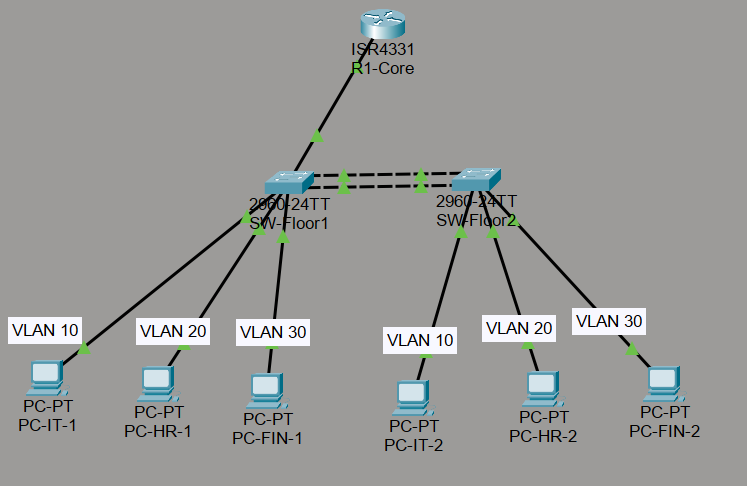
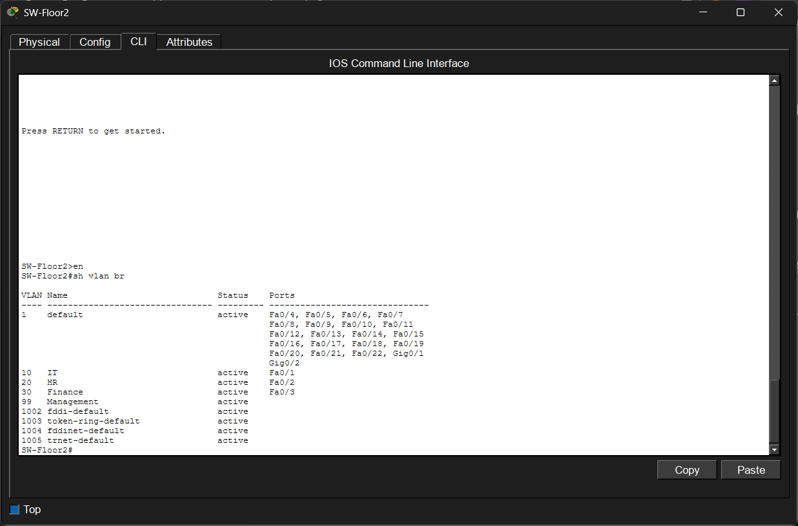

## 🟡 Level 2: Campus LAN with VLANs

### 🎯 จุดประสงค์ของโปรเจกต์

เพื่อจำลองสถาปัตยกรรมระบบเครือข่ายสำหรับอาคารสำนักงานขนาดกลางที่มีการแบ่งโครงสร้างองค์กรออกเป็นหลายแผนก โดยเน้นการบริหารจัดการเครือข่ายอย่างเป็นระบบ ปลอดภัย และสามารถขยายระบบได้ในอนาคต

- ออกแบบเครือข่ายโดยแบ่งผู้ใช้งานออกเป็น VLAN ตามแผนก ได้แก่ IT, HR และ Finance
- ลด Broadcast Domain และเพิ่มประสิทธิภาพการรับส่งข้อมูลภายในองค์กร
- ฝึกใช้งานเทคโนโลยี VLAN (Virtual LAN) เพื่อแยกกลุ่มผู้ใช้งานตามหน้าที่รับผิดชอบ
- ฝึกทำ Inter-VLAN Routing ด้วยเทคนิค Router-on-a-Stick ผ่าน Sub-Interface บน Router
- เรียนรู้การใช้งาน Trunk Link เพื่อส่งข้อมูลหลาย VLAN ผ่านสายสัญญาณเส้นเดียว
- ประยุกต์ใช้งาน EtherChannel เพื่อรวมลิงก์ระหว่างสวิตช์ เพิ่ม Bandwidth และรองรับความเสียหายของลิงก์
- ฝึกใช้งาน VLAN Management สำหรับบริหารจัดการอุปกรณ์เครือข่ายผ่าน VLAN 99
- เสริมความปลอดภัยของระบบ LAN ด้วย Port Security เพื่อป้องกันการเชื่อมต่ออุปกรณ์ที่ไม่ได้รับอนุญาต

---

## 🖼️ Network Topology



---

## 🏗️ VLAN Design

| VLAN ID | VLAN Name | Network Address | Gateway |
|----------|------------|----------------|----------|
| 10 | IT | 10.0.10.0/24 | 10.0.10.1 |
| 20 | HR | 10.0.20.0/24 | 10.0.20.1 |
| 30 | Finance | 10.0.30.0/24 | 10.0.30.1 |
| 99 | Management | 10.0.99.0/24 | 10.0.99.1 |

---

## 🔬 เกณฑ์และวิธีการทดสอบระบบ (Verification Checklist)

### 1. การตรวจสอบ VLAN

เข้าสู่ CLI ของ SW-Floor1 หรือ SW-Floor2

```bash
show vlan brief
```

ผลลัพธ์ต้องแสดง VLAN ดังต่อไปนี้

- VLAN 10 (IT)
- VLAN 20 (HR)
- VLAN 30 (Finance)
- VLAN 99 (Management)

รวมถึงพอร์ต Access ต้องอยู่ใน VLAN ที่กำหนดไว้ถูกต้อง

#### 📷 ผลการทดสอบ VLAN



---

### 2. การตรวจสอบ Trunk Link

บน SW-Floor1 ให้ตรวจสอบสถานะพอร์ตที่เชื่อมต่อกับ R1-Core

```bash
show interfaces trunk
```

ผลลัพธ์ต้องแสดง

- Native VLAN = 99
- VLAN 10, 20, 30 และ 99 ถูก Allow ผ่าน Trunk
- สถานะพอร์ตเป็น Trunk

---

### 3. การตรวจสอบ EtherChannel

ตรวจสอบสถานะ EtherChannel ระหว่าง SW-Floor1 และ SW-Floor2

```bash
show etherchannel summary
```

ผลลัพธ์ต้องแสดง

- Port-Channel 1 (Po1)
- สถานะขึ้นเป็น `(SU)`
- พอร์ต FastEthernet0/23 และ FastEthernet0/24 เข้าร่วมกลุ่มสำเร็จ

---

### 4. การทดสอบ Inter-VLAN Routing

จากเครื่อง PC-IT-1

```bash
ping 10.0.20.11
```

ทดสอบติดต่อจาก PC-IT-1 ไปยังเครื่อง PC-HR-2

จากนั้นทดสอบเพิ่มเติม

```bash
ping 10.0.20.12
```

ทดสอบติดต่อไปยังเครื่อง PC-HR-2 ผลลัพธ์ต้องได้รับ Reply ครบทุก Packet

---

### 5. การตรวจสอบ Sub-Interface บน Router

เข้าสู่ CLI ของ R1-Core

```bash
show ip interface brief
```

ผลลัพธ์ต้องแสดง

- GigabitEthernet0/0/0.10
- GigabitEthernet0/0/0.20
- GigabitEthernet0/0/0.30
- GigabitEthernet0/0/0.99

โดยทุก Interface ต้องมีสถานะ Up/Up

---

### 6. การทดสอบ Port Security

บนพอร์ต FastEthernet0/1 ของ SW-Floor1

- เชื่อมต่อ PC-IT-1 เพื่อให้ระบบเรียนรู้ MAC Address
- ถอดสายออก
- นำเครื่องคอมพิวเตอร์เครื่องใหม่ (Attacker-PC) มาเชื่อมต่อแทน

เมื่อเกิด MAC Address ที่ไม่ตรงกับ Sticky MAC ที่บันทึกไว้ ระบบต้อง

- ปิดพอร์ตโดยอัตโนมัติ
- เปลี่ยนสถานะพอร์ตเป็น Err-Disabled
- แสดงไฟพอร์ตสีแดงบน Packet Tracer

ตรวจสอบด้วยคำสั่ง

```bash
show port-security interface fastEthernet0/1
```

และ

```bash
show interface status
```
