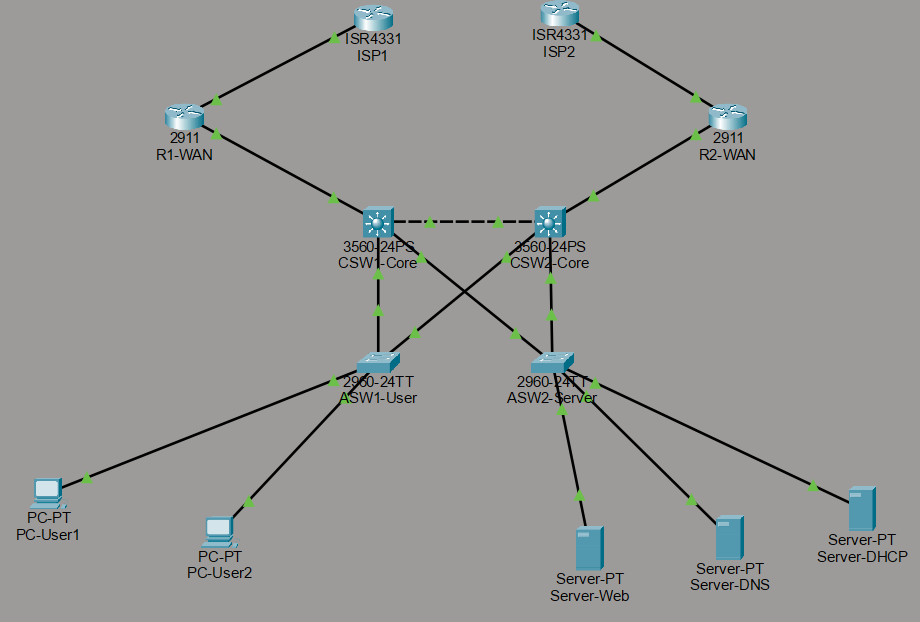
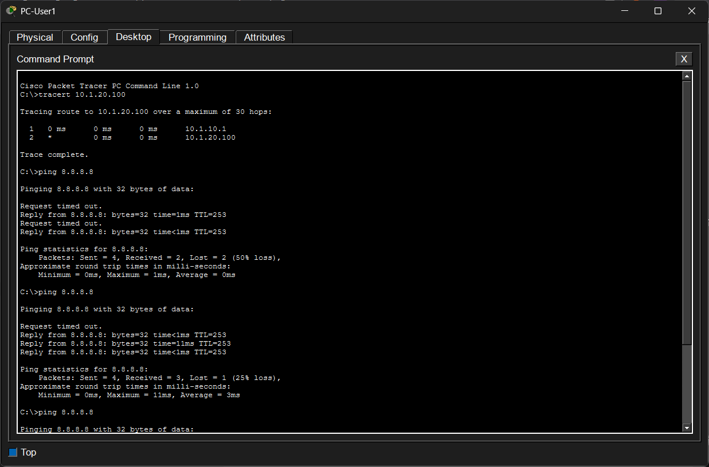
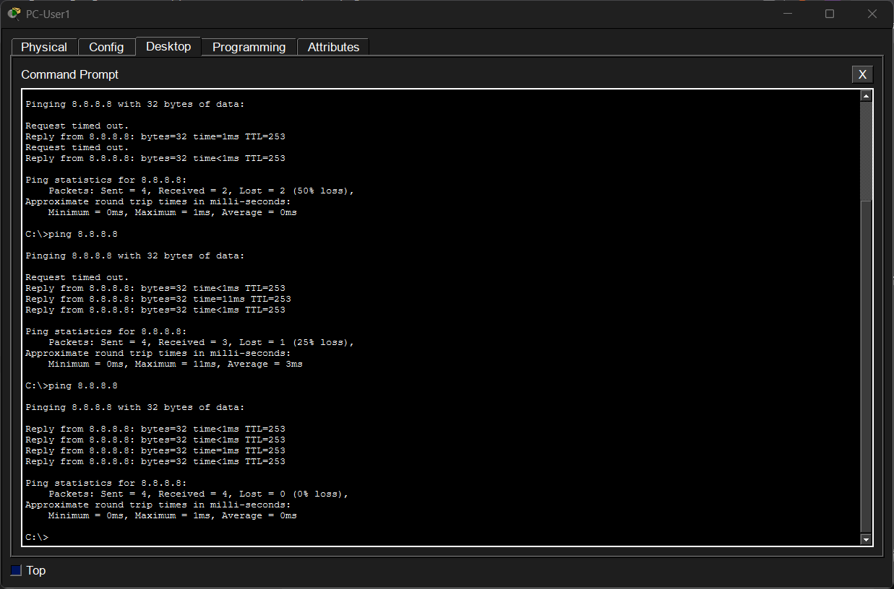

## 🔴 Level 3: Enterprise Network with Redundancy (HSRP + OSPF + Dual WAN)

### 🎯 จุดประสงค์ของโปรเจกต์

เพื่อจำลองสถาปัตยกรรมระบบเครือข่ายองค์กรที่มีความพร้อมใช้งานสูง (High Availability) และรองรับการทำงานต่อเนื่องแม้เกิดความเสียหายของอุปกรณ์หรือเส้นทางเชื่อมต่อ โดยใช้เทคโนโลยี Redundant Core Switch, HSRP, Dynamic Routing และ Dual WAN

* ออกแบบระบบ Core Network แบบ Redundant ด้วย Core Switch จำนวน 2 ตัว
* ใช้งาน HSRP (Hot Standby Router Protocol) เพื่อสร้าง Default Gateway สำรองสำหรับผู้ใช้งาน
* กำหนด Spanning Tree Root Primary และ Secondary เพื่อควบคุมเส้นทาง Layer 2
* ใช้งาน OSPF (Open Shortest Path First) สำหรับ Dynamic Routing ระหว่าง Core Switch และ Edge Router
* ออกแบบ Dual WAN เพื่อเชื่อมต่อออกสู่อินเทอร์เน็ตผ่านผู้ให้บริการ 2 ราย
* เพิ่มความสามารถในการ Failover เมื่อ Router หรือ WAN Link ขัดข้อง
* แยกกลุ่มผู้ใช้งานด้วย VLAN และบริหารจัดการระบบผ่าน SVI บน Layer 3 Switch
* ทดสอบการสลับเส้นทางอัตโนมัติเมื่อเกิดความเสียหายของอุปกรณ์หลัก

---

## 🖼️ Network Topology



---

## 🏗️ VLAN Design

| VLAN ID | VLAN Name | Network Address | HSRP Virtual Gateway |
| ------- | --------- | --------------- | -------------------- |
| 10      | Users     | 10.1.10.0/24    | 10.1.10.254          |
| 20      | Servers   | 10.1.20.0/24    | 10.1.20.254          |

---

## 🔬 เกณฑ์และวิธีการทดสอบระบบ (Verification Checklist)

### 1. ทดสอบสถานะเริ่มต้น (Normal State)

#### ตรวจสอบเส้นทางการสื่อสาร

เปิด Command Prompt ที่ **PC-User1**

```bash
tracert 10.1.20.100
```

ผลลัพธ์ที่คาดหวัง

* Traffic จะวิ่งผ่าน Gateway หลักของ VLAN 10
* Hop แรกควรเป็น IP ของ CSW1-Core
* แสดงให้เห็นว่า HSRP กำหนดให้ CSW1-Core เป็น Active Gateway

#### 📷 ผลการทดสอบ Traceroute



---

#### ตรวจสอบการเชื่อมต่อไปยังเครือข่ายปลายทาง

```bash
ping 8.8.8.8
```

ผลลัพธ์ที่คาดหวัง

* ได้รับ Reply ครบทุก Packet
* สามารถสื่อสารกับเครือข่ายภายนอกได้ตามปกติ

#### 📷 ผลการทดสอบ Connectivity



---

#### ตรวจสอบสถานะ HSRP

บน CSW1-Core

```cisco
show standby brief
```

ผลลัพธ์ที่คาดหวัง

* CSW1-Core อยู่ในสถานะ Active
* CSW2-Core อยู่ในสถานะ Standby
* Virtual Gateway ทำงานปกติ

#### 📷 ผลการทดสอบ HSRP

CSW1-Core


CSW2-Core


---

#### ตรวจสอบ OSPF Neighbor

บน CSW1-Core

```cisco
show ip ospf neighbor
```

ผลลัพธ์ที่คาดหวัง

* Neighbor กับ CSW2-Core อยู่ในสถานะ FULL
* Neighbor กับ R1-WAN อยู่ในสถานะ FULL

#### 📷 ผลการทดสอบ OSPF


---

### 2. ทดสอบเมื่อสายขาดหรือ Core Switch ล้มเหลว (Failover Test)

เลือกเครื่องมือ **Delete (รูปกากบาทสีแดง)** ใน Packet Tracer ลบสายเชื่อมต่อระหว่าง

```text
ASW1-User ↔ CSW1-Core
```

ผลลัพธ์ที่คาดหวัง

* พอร์ตสำรองที่เชื่อมกับ CSW2-Core จะเริ่มเข้าสู่สถานะ Forwarding
* RSTP จะคำนวณเส้นทางใหม่ภายในไม่กี่วินาที
* ไฟสถานะพอร์ตที่เดิมเป็นสีส้มจะเปลี่ยนเป็นสีเขียว

---

ขณะเดียวกันให้เปิด Command Prompt ที่ PC-User1 แล้วสั่ง

```bash
ping 8.8.8.8
```

ผลลัพธ์ที่คาดหวัง

* อาจเกิด Request timed out จำนวน 1–2 ครั้ง
* HSRP บน CSW2-Core จะรับบทบาทเป็น Gateway แทน

#### 📷 ผลการทดสอบ Failover


