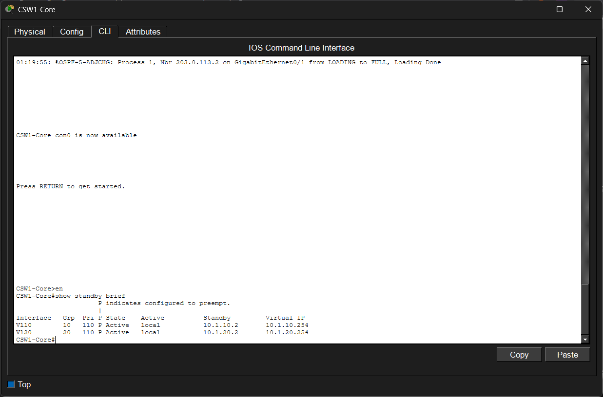
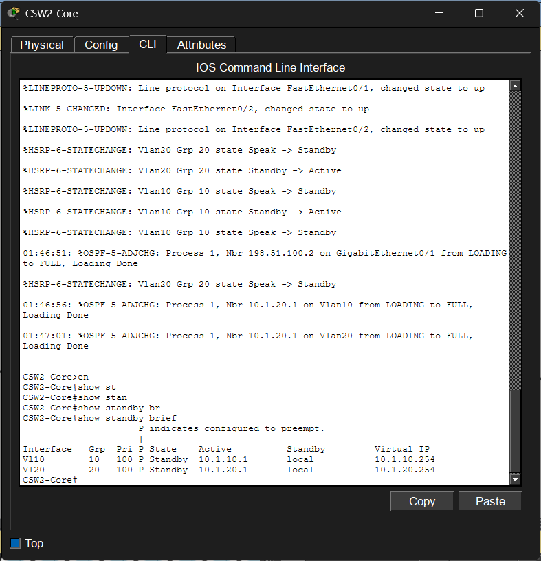
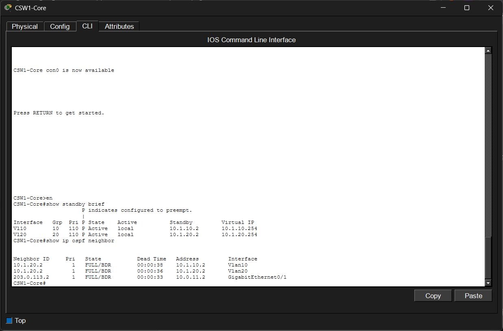
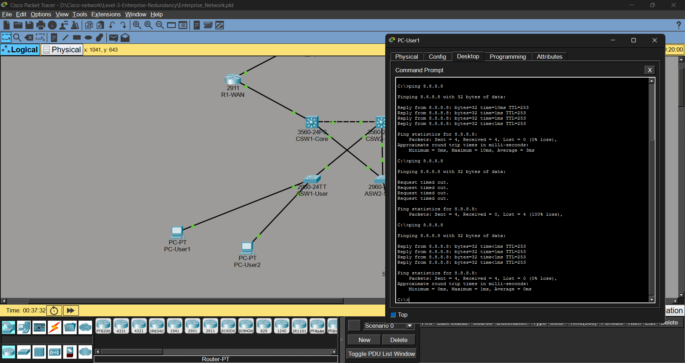

## 🟠 Level 3: Enterprise Network with Redundancy (HSRP + OSPF + Dual WAN)

### 🎯 จุดประสงค์ของโปรเจกต์ (Project Objectives)

โปรเจกต์นี้จัดทำขึ้นเพื่อจำลองและออกแบบสถาปัตยกรรมระบบเครือข่ายระดับองค์กรที่มีความพร้อมใช้งานสูง (**High Availability: HA**) เพื่อรองรับการดำเนินงานของธุรกิจได้อย่างต่อเนื่อง (**Business Continuity**) แม้เกิดความเสียหายบนอุปกรณ์หลักหรือเส้นทางการเชื่อมต่อ โดยมีวัตถุประสงค์เชิงเทคนิคดังนี้

* **High Availability Core Network:** ออกแบบระบบเครือข่ายหลักแบบ Redundant ด้วย Layer 3 Core Switch จำนวน 2 ตัว เพื่อขจัดปัญหา Single Point of Failure (SPOF)
* **Gateway Redundancy (HSRP):** ประยุกต์ใช้โปรโตคอล Hot Standby Router Protocol เพื่อสร้าง Default Gateway สำรอง ช่วยให้ผู้ใช้งานสามารถใช้งานเครือข่ายได้อย่างไร้รอยต่อเมื่อเกิดเหตุขัดข้อง
* **Spanning Tree Protocol (STP) Tuning:** กำหนดค่า Root Primary และ Secondary เพื่อควบคุมโครงสร้างและเส้นทางในระดับ Layer 2 ป้องกันการเกิด Loop และสลับสายสำรองได้ทันที
* **Dynamic Routing (OSPF):** คอนฟิกโปรโตคอล OSPF ระหว่าง Core Switch และ Edge Router เพื่อให้ระบบแลกเปลี่ยนและอัปเดตตารางเส้นทาง (Routing Table) อัตโนมัติ
* **Dual WAN Link Infrastructure:** ออกแบบระบบอินเทอร์เน็ตขาออกให้รองรับโครงสร้างแบบ Dual WAN ผ่านผู้ให้บริการ (ISP) 2 ราย เพื่อทำ Link Redundancy
* **Automated Failover Mechanism:** เพิ่มความสามารถในการตรวจจับและสลับเส้นทางโดยอัตโนมัติ (Failover) ทั้งระบบเครือข่ายภายในและฝั่ง WAN Link
* **Network Segmentation (VLAN & SVI):** แยกกลุ่มและประเภทผู้ใช้งานด้วย VLAN เพื่อความปลอดภัยและความง่ายในการบริหารจัดการ พร้อมทำ Routing ภายในผ่าน Switch Virtual Interface (SVI)
* **System Verification & Stress Test:** จำลองสถานการณ์และทดสอบการล่มของระบบ (Failover Testing) เพื่อวัดประสิทธิภาพ ความเร็วในการ Convergence และความทนทานของสถาปัตยกรรมที่ออกแบบ

---

## 🖼️ Network Topology


---

## 🏗️ VLAN Design

| VLAN ID | VLAN Name | Network Address | HSRP Virtual Gateway |
| ------- | --------- | --------------- | -------------------- |
| 10      | Users     | 10.1.10.0/24    | 10.1.10.254          |
| 20      | Servers   | 10.1.20.0/24    | 10.1.20.254          |

---

## 🔬 เกณฑ์และวิธีการทดสอบระบบ (Verification Checklist)

### 1. ทดสอบสถานะเริ่มต้น (Normal State)

#### ตรวจสอบเส้นทางการสื่อสาร

เปิด Command Prompt ที่ **PC-User1**

```bash
tracert 10.1.20.100
```

ผลลัพธ์ที่คาดหวัง

* Traffic จะวิ่งผ่าน Gateway หลักของ VLAN 10
* Hop แรกควรเป็น IP ของ CSW1-Core
* แสดงให้เห็นว่า HSRP กำหนดให้ CSW1-Core เป็น Active Gateway

#### 📷 ผลการทดสอบ Traceroute


---

#### ตรวจสอบการเชื่อมต่อไปยังเครือข่ายปลายทาง

```bash
ping 8.8.8.8
```

ผลลัพธ์ที่คาดหวัง

* ได้รับ Reply ครบทุก Packet
* สามารถสื่อสารกับเครือข่ายภายนอกได้ตามปกติ

#### 📷 ผลการทดสอบ Connectivity


---

#### ตรวจสอบสถานะ HSRP

บน CSW1-Core

```cisco
show standby brief
```

ผลลัพธ์ที่คาดหวัง

* CSW1-Core อยู่ในสถานะ Active
* CSW2-Core อยู่ในสถานะ Standby
* Virtual Gateway ทำงานปกติ

#### 📷 ผลการทดสอบ HSRP

CSW1-Core



CSW2-Core



---

#### ตรวจสอบ OSPF Neighbor

บน CSW1-Core

```cisco
show ip ospf neighbor
```

ผลลัพธ์ที่คาดหวัง

* Neighbor กับ CSW2-Core อยู่ในสถานะ FULL
* Neighbor กับ R1-WAN อยู่ในสถานะ FULL

#### 📷 ผลการทดสอบ OSPF



---

### 2. ทดสอบเมื่อสายขาดหรือ Core Switch ล้มเหลว (Failover Test)

เลือกเครื่องมือ **Delete (รูปกากบาทสีแดง)** ใน Packet Tracer ลบสายเชื่อมต่อระหว่าง

```text
ASW1-User ↔ CSW1-Core
```

ผลลัพธ์ที่คาดหวัง

* พอร์ตสำรองที่เชื่อมกับ CSW2-Core จะเริ่มเข้าสู่สถานะ Forwarding
* RSTP จะคำนวณเส้นทางใหม่ภายในไม่กี่วินาที

---

ขณะเดียวกันให้เปิด Command Prompt ที่ PC-User1 แล้วสั่ง

```bash
ping 8.8.8.8
```

ผลลัพธ์ที่คาดหวัง

* อาจเกิด Request timed out จำนวน 1–2 ครั้ง
* HSRP บน CSW2-Core จะรับบทบาทเป็น Gateway แทน

#### 📷 ผลการทดสอบ Failover


