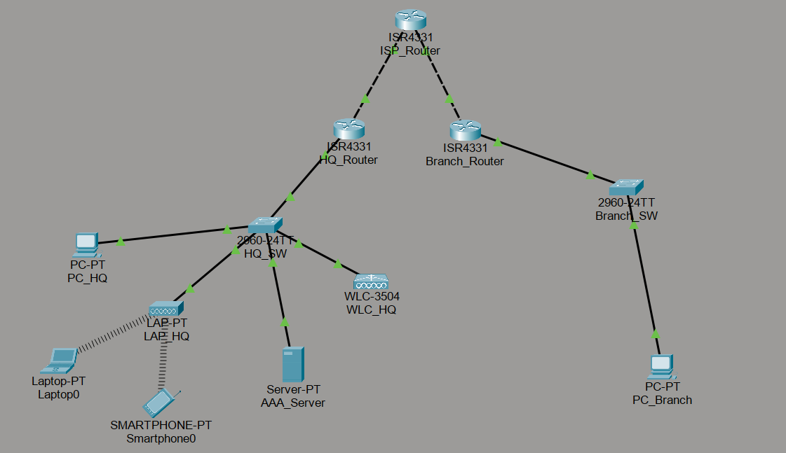
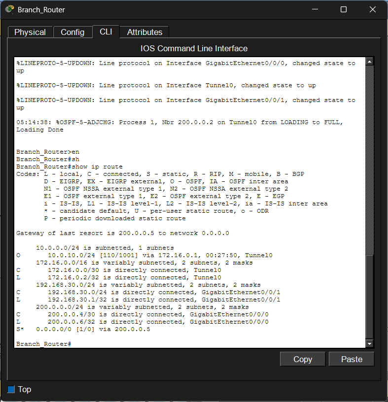
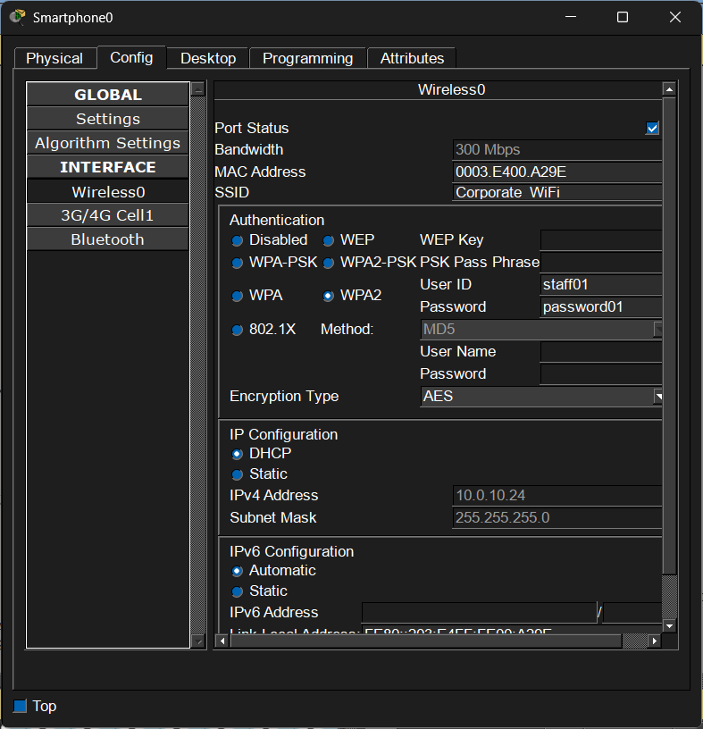
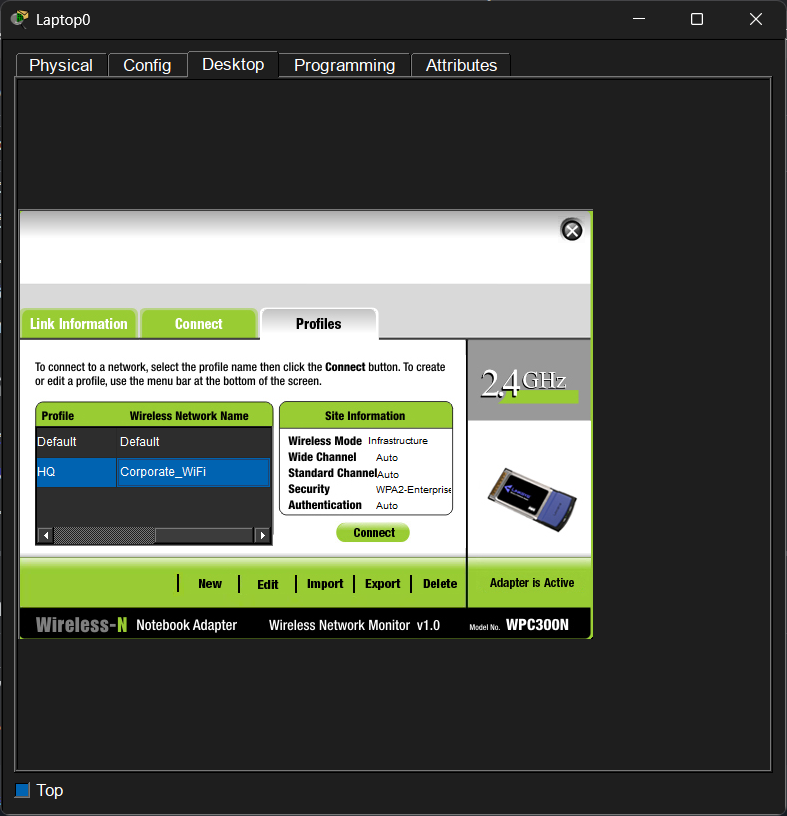
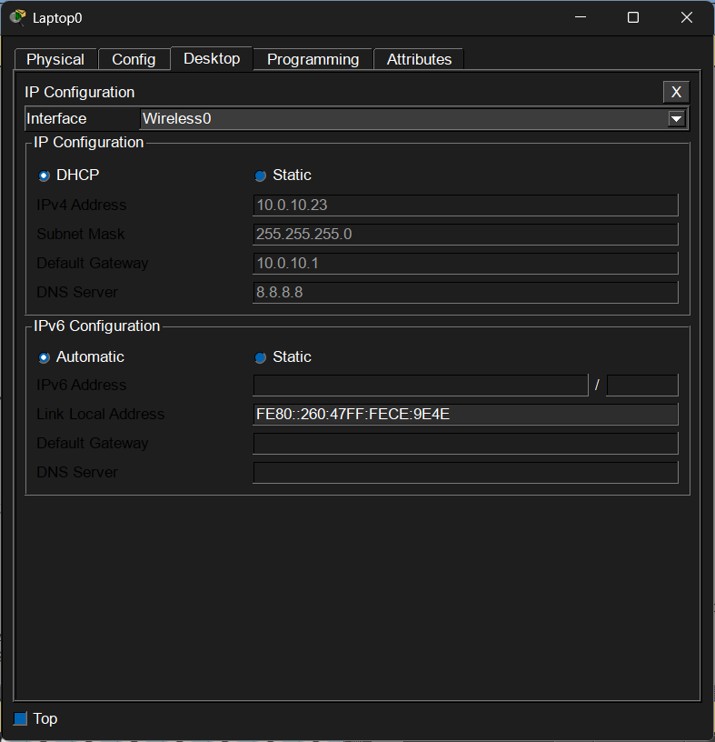
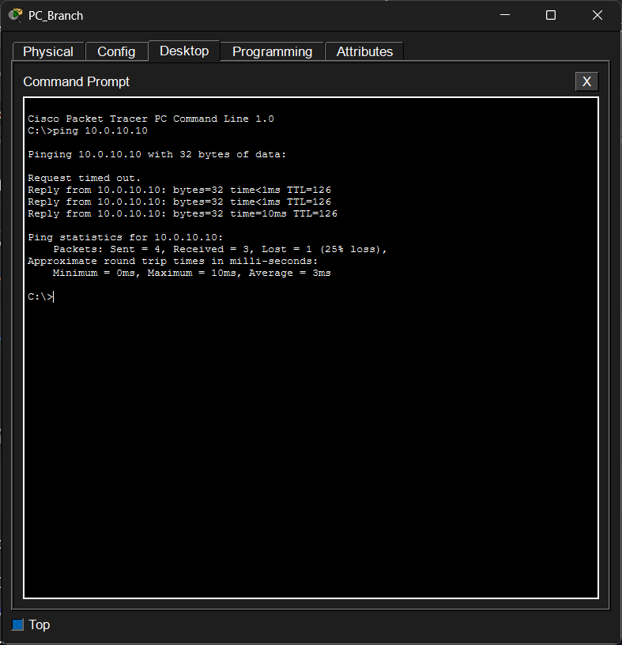

# 🔴 Level 4: Enterprise Multi-Site WAN & Advanced Security

## 🎯 วัตถุประสงค์ของโปรเจกต์ (Project Objectives)

โปรเจกต์นี้เป็นการจำลองระบบเครือข่ายระดับองค์กรที่เชื่อมต่อระหว่างสำนักงานใหญ่ (HQ) และสาขาย่อย (Branch) ผ่านเครือข่ายอินเทอร์เน็ตสาธารณะ โดยมุ่งเน้นด้านความปลอดภัย การบริหารจัดการแบบรวมศูนย์ และการรองรับการขยายตัวขององค์กรในอนาคต

### ความสามารถหลักของระบบ

#### 🔐 Secure Site-to-Site VPN (GRE over IPsec)

เชื่อมต่อเครือข่ายระหว่างสำนักงานใหญ่และสาขาผ่านอินเทอร์เน็ตด้วย GRE Tunnel พร้อมเข้ารหัสข้อมูลด้วย IPsec เพื่อป้องกันการดักฟังและเพิ่มความปลอดภัยในการรับส่งข้อมูล

#### 🌐 Dynamic Routing over VPN (OSPF)

ใช้งาน OSPF ผ่าน GRE Tunnel เพื่อให้แต่ละสาขาแลกเปลี่ยนข้อมูลเส้นทาง (Routing Information) และอัปเดต Routing Table ได้โดยอัตโนมัติ

#### 📡 Centralized Wireless Management (WLC)

บริหารจัดการระบบเครือข่ายไร้สายจากศูนย์กลางด้วย Wireless LAN Controller (WLC) โดย Access Point ทุกตัวสามารถเชื่อมต่อและรับการตั้งค่าผ่าน CAPWAP ได้อัตโนมัติ

#### 🔑 Enterprise Authentication (AAA / RADIUS)

เพิ่มความปลอดภัยของเครือข่ายไร้สายด้วยมาตรฐาน WPA2-Enterprise (802.1X) โดยผู้ใช้งานต้องยืนยันตัวตนผ่าน AAA/RADIUS Server ก่อนเข้าใช้งานเครือข่าย

#### 🛡️ Access Control Lists (ACLs)

กำหนดนโยบายความปลอดภัยบน Router เพื่ออนุญาตเฉพาะทราฟฟิกที่จำเป็น เช่น ISAKMP, ESP, GRE และ OSPF พร้อมป้องกันการเข้าถึงที่ไม่ได้รับอนุญาต

#### 📋 DHCP Option 43 Integration

กำหนด DHCP Server ให้แจก Option 43 เพื่อให้ Lightweight Access Point สามารถค้นหาและเชื่อมต่อกับ WLC ได้โดยอัตโนมัติ

---

# 🖼️ Network Topology



---

# 🏗️ Network Design & IP Addressing

| Site         | Network    | Network Address | Gateway                 | Description                     |
| ------------ | ---------- | --------------- | ----------------------- | ------------------------------- |
| HQ           | HQ LAN     | 10.0.10.0/24    | 10.0.10.1               | ที่ตั้ง WLC และ AAA Server      |
| Branch       | Branch LAN | 192.168.30.0/24 | 192.168.30.1            | เครือข่ายผู้ใช้งานสาขา          |
| VPN          | GRE Tunnel | 172.16.0.0/30   | 172.16.0.1 / 172.16.0.2 | ลิงก์ VPN ที่เข้ารหัสด้วย IPsec |
| WAN (HQ)     | ISP Link 1 | 200.0.0.0/30    | 200.0.0.2               | Public IP ของสำนักงานใหญ่       |
| WAN (Branch) | ISP Link 2 | 200.0.0.4/30    | 200.0.0.6               | Public IP ของสาขาย่อย           |

---

# 🔬 Verification Checklist

## 1️. ตรวจสอบสถานะ VPN (GRE over IPsec)

### คำสั่งที่ใช้

```cisco
show crypto isakmp sa
show crypto ipsec sa
```

### ผลลัพธ์ที่คาดหวัง

**ISAKMP Phase 1**

* สถานะต้องเป็น `QM_IDLE`
* แสดงว่าการสร้าง VPN Tunnel สำเร็จ

**IPsec Phase 2**

* ค่า `#pkts encaps`
* ค่า `#pkts decaps`

ต้องมีตัวเลขเพิ่มขึ้น แสดงว่ามีการเข้ารหัสและถอดรหัสข้อมูลจริง

#### 📸 ผลลัพธ์ของทั้งสองคำสั่ง

.png)

---

## 2️. ตรวจสอบ Dynamic Routing (OSPF)

### คำสั่งที่ใช้

บน Branch_Router

```cisco
show ip route
```

### ผลลัพธ์ที่คาดหวัง

ต้องพบเส้นทางของสำนักงานใหญ่ใน Routing Table เช่น

```text
O 10.0.10.0/24
```

ตัวอักษร `O` หมายถึงเส้นทางที่เรียนรู้ผ่าน OSPF

#### 📸 Routing Table ที่แสดงเส้นทาง OSPF



---

## 3️. ตรวจสอบ Wi-Fi Authentication ผ่าน AAA/RADIUS

### ทดสอบด้วย Smartphone

1. ไปที่ Config → Wireless0
2. กำหนด SSID
3. เลือก WPA2
4. กรอก Username และ Password

ตัวอย่าง

```text
Username : staff01
Password : password01
```

### ทดสอบด้วย Laptop

1. ปิดเครื่อง Laptop
2. เปลี่ยน Network Module เป็น WPC300N
3. เปิดเครื่องใหม่
4. ไปที่ Desktop → PC Wireless
5. เลือก SSID ขององค์กร
6. กรอก Username และ Password

### ผลลัพธ์ที่คาดหวัง

* เชื่อมต่อ Wi-Fi สำเร็จ
* ผ่านการยืนยันตัวตนจาก AAA Server
* ได้รับ IP Address จาก DHCP Server

#### 📸 แสดงสถานะเชื่อมต่อ Wi-Fi และได้รับ IP Address สำเร็จ

Smartphone



Laptop





---

## 4️. ตรวจสอบ End-to-End Connectivity

### คำสั่งที่ใช้

จาก PC ฝั่ง Branch

```bash
ping 10.0.10.10
```

โดย 10.0.10.10 คือ AAA Server ที่สำนักงานใหญ่

### ผลลัพธ์ที่คาดหวัง

```text
Reply from 10.0.10.10
```

การตอบกลับสำเร็จแสดงว่า

* Client เชื่อมต่อ Wi-Fi สำเร็จ
* ผ่านการยืนยันตัวตนกับ AAA Server
* ได้รับ IP Address จาก DHCP
* OSPF แลกเปลี่ยนเส้นทางสำเร็จ
* GRE Tunnel ทำงานปกติ
* IPsec VPN เข้ารหัสข้อมูลได้ถูกต้อง
* สามารถเข้าถึงทรัพยากรข้ามสาขาได้

#### ผลลัพธ์การ Ping สำเร็จ


